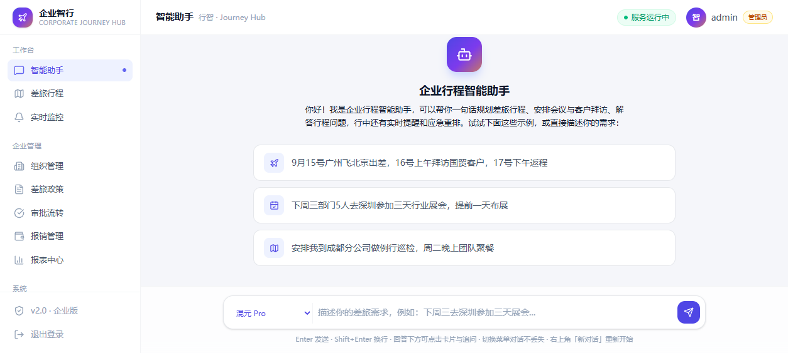
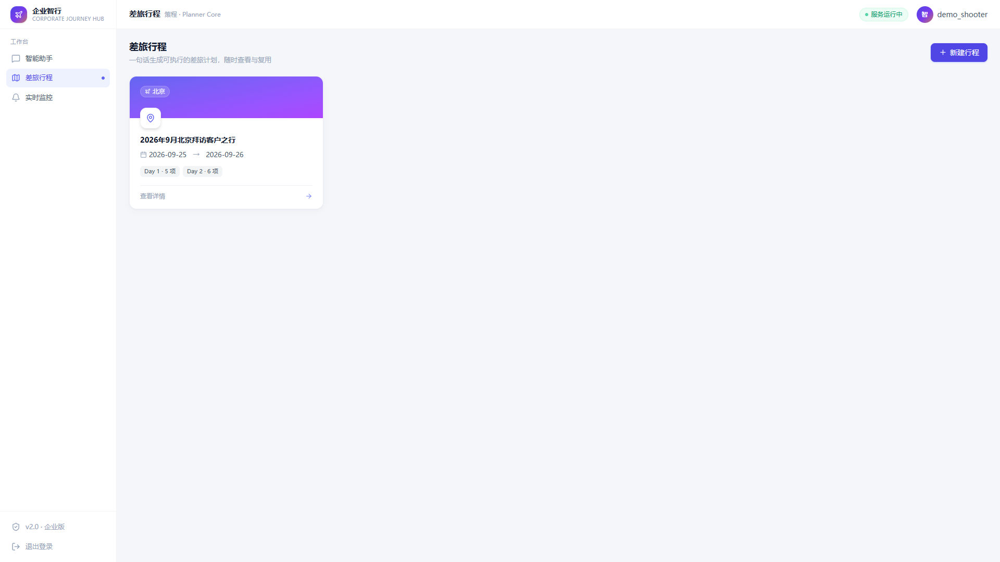
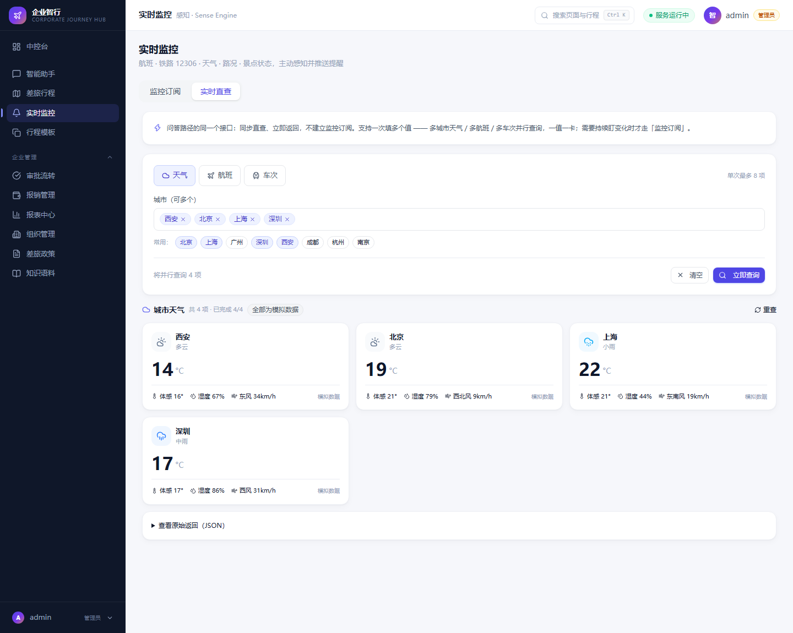

# 企业智行 · Corporate Journey Hub

> 面向企业内部的智能行程规划与安排平台，以 LLM 为大脑、以多源实时数据为感知，覆盖「行前规划 → 行中保障 → 行后归档」全链路。

> 📌 **完整项目文档**（背景/架构/进度/踩坑/数据口径）见 [`docs/项目文档.md`](docs/项目文档.md)。
> 📌 **实时进度主线**见 [`docs/项目文档.md`](docs/项目文档.md) 第七节「目前进度」；开发过程关键节点见 [`docs/开发手册/`](docs/开发手册/01-开发关键节点日志.md)。

## 界面预览

| 智能助手（行智） | 差旅行程（策程） | 实时监控（感知） |
|:---:|:---:|:---:|
|  |  |  |

## 项目概述

三服务架构（行智 Agent 编排 / 策程行程规划 / 感知实时监控）+ shared 公共层，**单体模式（默认）单进程单端口 8001，一键切换微服务模式**。

行程生成双路径：商务类场景（出差/会议/拜访/团队）**模板直出，典型差旅句式全链路 0 次 LLM**（提取 + 生成毫秒级返回）；个人出游走 LLM + 景点攻略语料 RAG。支持自助注册与无状态签名会话，行程先出草案、确认后才落库并联政策审批。

## 技术栈

| 层次 | 技术选型 |
|:---|:---|
| Web 框架 | FastAPI + Uvicorn |
| AI 编排 | LangGraph (StateGraph) |
| LLM | 腾讯 TokenHub `deepseek-v4-flash`（主）/ kimi-k3 / hy-mt2-pro |
| 向量检索 | 可插拔：本地 bge-large-zh-v1.5 / OpenAI 兼容 / 关键词降级 |
| 前端 | React 19 + Vite 8 + Tailwind CSS 4 |
| 外部数据 | 腾讯位置服务（SN 签名）+ 和风天气 + 12306 |
| 可观测性 | Prometheus + 结构化日志 + 全链路 Trace |

## 快速开始

**日常只需双击 `start.bat` 启动、双击 `停止.bat` 停止**（默认单体模式：三服务合并为单进程 8001）。

```bash
python launcher.py            # 默认单体启动：单进程单端口 8001
python launcher.py micro      # 微服务模式（8001/8002/8003）
python launcher.py stop       # 停止全部服务（含前端）
python launcher.py status     # 查看服务状态
```

- 每次启动自动清掉上一次对话记录，行程/审批/报销等业务数据保留
- 前端工作台：http://localhost:3001
- 接口文档：http://localhost:8001/docs · http://localhost:8001/planner/docs · http://localhost:8001/sense/docs

## 测试

```bash
pytest --basetemp=./.pytest_tmp -q
```

**201 passed / 0 failed**（13 个测试文件，2026-09-18 实测 46.3s）。
